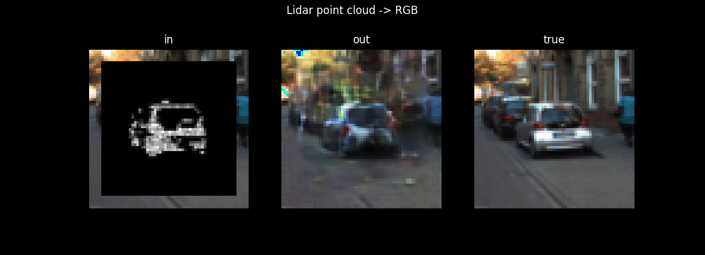
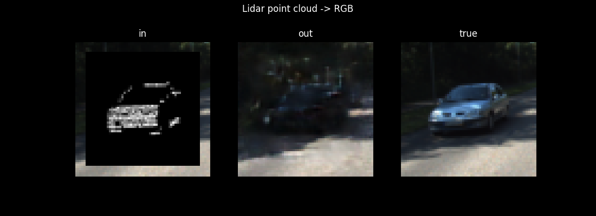
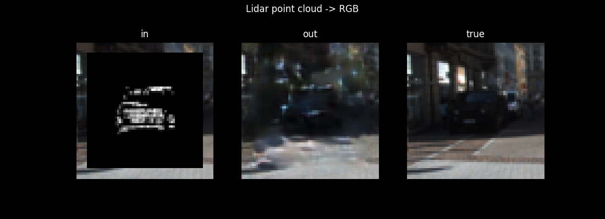
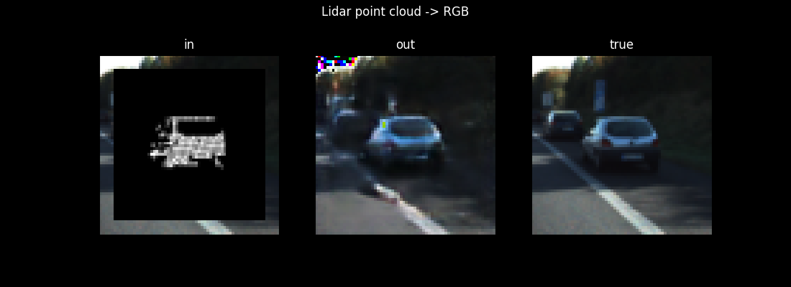
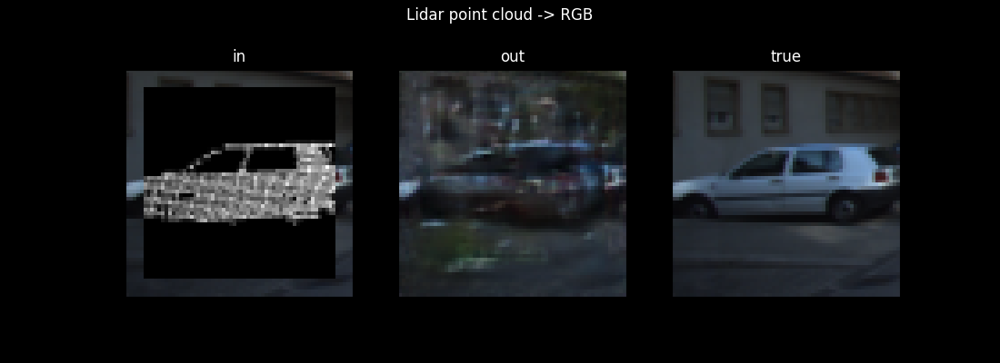
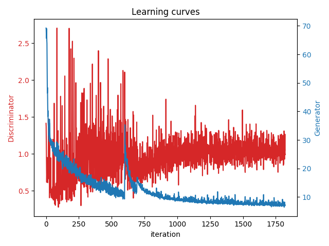

# 3D point cloud to image translation using GAN in PyTorch
Based on part of https://arxiv.org/abs/1901.09280.

# Environment
Venv:

```console
$ virtualenv <env_name>
$ source <env_name>/bin/activate 
(<env_name>) $ pip install -r requirements.txt 
```
and install your favourite version of [PyTorch](https://pytorch.org/get-started/locally/).

## Export cropped images of objects and their corresponding 3D point clouds 
Heads up: This preprocessing of the Kitti dataset takes hours due to the point cloud search for each image required to extract objects.
1. download left image, velodyne points, labels, calibration: https://www.cvlibs.net/datasets/kitti/eval_object.php?obj_benchmark=3d
    * put them in ./data/raw:
        * ./data/raw/calib
        * ./data/raw/image_2
        * ./data/raw/label_2
        * ./data/raw/velodyne
2. crop point clouds to camera field of view: 
```python scripts/crop_point_clouds.py```

3. extract cropped images of objects: 
```python scripts/extract_images.py```

4. filter dataset by the number of points per object (default: 300): 
```python scripts/create_data_subset.py```

## Train and test
5. run the notebook to train and test

## Results
### Generating 64x64 images on unseen test input:







### The learning process:



## References
https://github.com/dtczhl/dtc-KITTI-For-Beginners/blob/master/README.md

https://github.com/qianguih/voxelnet/blob/master/data/crop.py

https://github.com/azureology/kitti-velo2cam/blob/master/proj_velo2cam.py

https://www.kaggle.com/code/truthisneverlinear/attention-u-net-pytorch#Attention-U-Net

https://github.com/junyanz/pytorch-CycleGAN-and-pix2pix/blob/da39a525eb793614807db4330cfe9b2157bbe33a/models/networks.py#L539

https://phillipi.github.io/pix2pix/